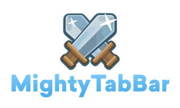

<!-- PROJECT SHIELDS -->
[![Build Status][build-shield]]()
[](https://cocoapods.org/pods/MightyTabBar)
[](https://github.com/Carthage/Carthage)
[](https://developer.apple.com/swift/)
[![Contributors][contributors-shield]]()
[![MIT License][license-shield]](https://github.com/timshim/MightyTabBar/blob/master/LICENSE)
[](https://twitter.com/timshim)

<!-- PROJECT LOGO -->
<br />
<p align="center">
  <a href="https://github.com/timshim/MightyTabBar">
    
  </a>

  <h3 align="center">MightyTabBar</h3>
  <p align="center">
    How tab bars should work.
  </p>
</p>

<!-- TABLE OF CONTENTS -->
## Table of Contents

* [Description](#description)
* [Getting Started](#getting-started)
  * [Requirements](#requirements)
  * [Demo](#demo)
* [Installation](#installation)
* [Usage](#usage)
* [Contributing](#contributing)
* [License](#license)
* [Contact](#contact)
* [Acknowledgements](#acknowledgements)

<!-- ABOUT THE PROJECT -->
## Description

[![Product Name Screen Shot][product-screenshot]](https://example.com)

MightyTabBar is a customizable tab bar that doubles as a menu drawer. Instead of being limited to 5 tab bar items, MightyTabBar allows your app to have up to 30 tab bar items, all positioned within the thumb zone and easily accessible via swipe up.

Here's why:
* Your time should be focused on creating something amazing. A project that solves a problem and helps others
* You shouldn't be doing the same tasks over and over like creating a README from scratch
* You should element DRY principles to the rest of your life :smile:

Of course, no one template will serve all projects since your needs may be different. So I'll be adding more in the near future. You may also suggest changes by forking this repo and creating a pull request or opening an issue with the tag.

A list of commonly used resources that I find helpful are listed in the acknowledgements.

<!-- GETTING STARTED -->
## Getting Started

This is an example of how you may give instructions on setting up your project locally.
To get a local copy up and running follow these simple example steps.

### Requirements

* Xcode 10 or later
* iOS 10.0 or later
* Swift 4 or later

### Demo

Run `pod install` in the MightTabBarExample folder. Open the MightyTabBarExample workspace. Build and run.

## Installation

### CocoaPods

``` 
pod MightyTabBar
```

### Carthage

```
github "timshim/MightyTabBar"
```

### Manually

```
git clone https://github.com/timshim/MightyTabBar.git
```

<!-- USAGE EXAMPLES -->
## Usage

Use this space to show useful examples of how a project can be used. Additional screenshots, code examples and demos work well in this space. You may also link to more resources.

_For more examples, please refer to the [Documentation](https://example.com)_

<!-- CONTRIBUTING -->
## Contributing

Contributions are what make the open source community such an amazing place to be learn, inspire, and create. Any contributions you make are **greatly appreciated**.

1. Fork the Project
2. Create your Feature Branch (`git checkout -b feature/AmazingFeature`)
3. Commit your Changes (`git commit -m 'Add some AmazingFeature`)
4. Push to the Branch (`git push origin feature/AmazingFeature`)
5. Open a Pull Request

<!-- LICENSE -->
## License

Distributed under the MIT License. See `LICENSE` for more information.

<!-- CONTACT -->
## Contact

Tim Shim - [@timshim](https://twitter.com/timshim) - timshim@gmail.com

<!-- ACKNOWLEDGEMENTS -->
## Acknowledgements
* [Img Shields](https://shields.io)
* [Choose an Open Source License](https://choosealicense.com)
* [GitHub Pages](https://pages.github.com)
* [Font Awesome](https://fontawesome.com)

<!-- MARKDOWN LINKS & IMAGES -->
[build-shield]: https://img.shields.io/badge/build-passing-brightgreen.svg?style=flat-square
[contributors-shield]: https://img.shields.io/badge/contributors-1-orange.svg?style=flat-square
[license-shield]: https://img.shields.io/badge/license-MIT-blue.svg?style=flat-square
[license-url]: https://choosealicense.com/licenses/mit
[product-screenshot]: https://raw.githubusercontent.com/othneildrew/Best-README-Template/master/screenshot.png
